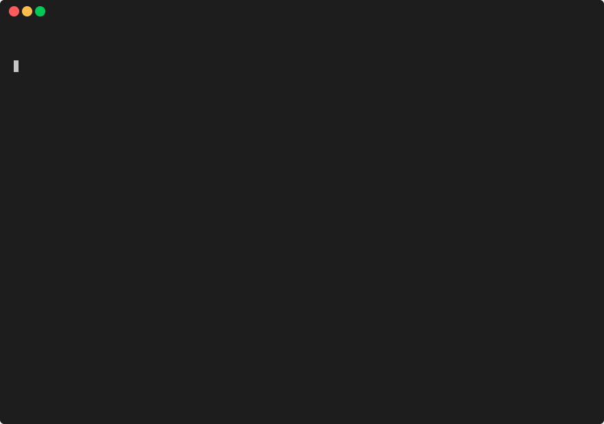

# SomaTUI

[](https://github.com/samuelb/somatui/actions/workflows/ci.yml)
[](https://golang.org/)
[](https://opensource.org/licenses/MIT)

**✨ This project was entirely vibe-coded. ✨**

A modern, TUI (Terminal User Interface) client for streaming and exploring SomaFM radio channels.



## Features

- Browse and filter the full list of SomaFM radio channels
- Play high-quality MP3 streams directly in your terminal
- View real-time track information (artist/title) from ICY metadata
- Buffered streaming with automatic reconnection on network issues
- Styled UI with color-coded playback states and visual indicators
- Select and remember your last-played channel
- Fast startup with cached channels and background refresh
- Smooth, keyboard-driven navigation and playback controls

## Installation

### Pre-built Binaries

1.  Download the latest release for your platform from the [Releases page](https://github.com/samuelb/somatui/releases).
2.  Extract the archive.
3.  Run the `somatui` executable.

#### macOS

After downloading, you may need to grant permission to run the application since it is not signed.

To do this, open a terminal and run:

```sh
xattr -d com.apple.quarantine /path/to/somatui
```

Alternatively, you can go to `System Preferences > Security & Privacy > General` and click `Open Anyway`.

#### Linux

After downloading, make the binary executable:

```sh
chmod +x /path/to/somatui
```

Then, you can run it from your terminal.

### Build from Source

Prerequisites: Go 1.24 or newer

```sh
git clone https://github.com/samuelb/somatui.git
cd somatui
go build -o somatui
```

## Usage

Simply run:

```sh
./somatui
```

To check the version:

```sh
./somatui --version
```

### Keyboard Controls

| Key                       | Action                |
| ------------------------- | --------------------- |
| <kbd>↑</kbd> / <kbd>k</kbd> | Navigate channels up  |
| <kbd>↓</kbd> / <kbd>j</kbd> | Navigate channels down|
| <kbd>Enter</kbd> / <kbd>Space</kbd> | Play selected channel |
| <kbd>s</kbd>               | Stop playback         |
| <kbd>/</kbd>               | Filter channels       |
| <kbd>q</kbd> / <kbd>Ctrl+C</kbd>  | Quit                  |

## Data Storage

- **State**: `~/.local/state/somatui/` (Linux) or `~/Library/Application Support/somatui/` (macOS)
- **Cache**: `~/.cache/somatui/` (Linux) or `~/Library/Caches/somatui/` (macOS)

## Dependencies

- [Bubble Tea](https://github.com/charmbracelet/bubbletea) (TUI framework)
- [Bubbles](https://github.com/charmbracelet/bubbles) (TUI components)
- [Lip Gloss](https://github.com/charmbracelet/lipgloss) (styling)
- [ansi](https://github.com/charmbracelet/x/ansi) (ANSI parsing)
- [oto/v3](https://github.com/ebitengine/oto) (audio output)
- [ebiten/v2](https://github.com/hajimehoshi/ebiten/v2) (game engine)

See `go.mod` for the full dependency list.

## Contributing

Contributions are welcome! Feel free to open issues or pull requests.

1. Fork the repo
2. Create a feature branch
3. Make your changes
4. Submit a pull request

## License

[MIT](LICENSE)

---

_This project is not affiliated with SomaFM. All content and station streams are provided by [somafm.com](https://somafm.com/)._
