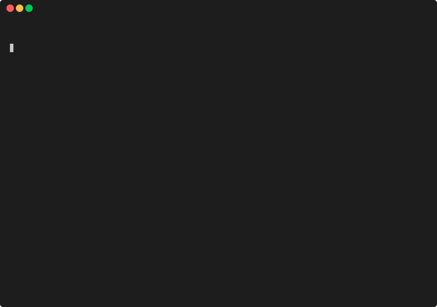

# somad

[](https://github.com/samuelb/somad/actions/workflows/ci.yml)
[](https://golang.org/)
[](https://opensource.org/licenses/MIT)

**✨ This project was entirely vibe-coded. ✨**

somad is a client for streaming and exploring SomaFM radio channels, with a
background playback daemon, a terminal UI, and headless CLI commands. Built for
Linux and macOS — other platforms are not supported and may not work.



## Features

- Client-server architecture: playback runs in a background server, so you
  can close the TUI and the music keeps playing (opt out with
  `soma --shutdown-on-exit`)
- The server starts automatically when needed and exits on its own once
  playback is stopped and no client is connected
- After an upgrade, the background server is restarted onto the new version the
  next time you change channel, pause, or stop — never mid-song just to upgrade,
  so music you're listening to keeps playing until you interrupt it yourself
- Headless CLI commands (`play`, `list`, `stop`, `status`, `volume`) for scripting
  and keybindings without opening the TUI
- Optional remote control over TCP — run the daemon on the machine wired to
  the speakers and the TUI/CLI on your laptop, with optional TLS encryption
  (auto-generated certificate) and pre-shared-key authentication
- Mark channels as favorites for quick access
- Browse and filter the full list of SomaFM radio channels
- Play high-quality MP3 streams directly in your terminal
- View real-time track information (artist/title) from ICY metadata
- Buffered streaming with automatic reconnection on network issues
- Styled UI with color-coded playback states and visual indicators
- Select and remember your last-played channel
- Fast startup with cached channels and background refresh
- Smooth, keyboard-driven navigation and playback controls
- MPRIS desktop integration (Linux) — media keys keep working even with the
  TUI closed
- System tray / menu-bar icon (macOS and Linux) — shows the current track,
  lets you pick any channel from a menu, and gives you play/stop, next, and
  previous while the server runs, even with the TUI closed. Disable
  it with `soma daemon --no-tray`.

## Installation

### Homebrew (macOS and Linux)

```sh
brew tap samuelb/tap
brew install somad
```

This installs a pre-built binary from the [latest release](https://github.com/samuelb/somad/releases),
so no compiler is required. Upgrade later with `brew upgrade somad`.

Recent versions of Homebrew ask you to explicitly trust a third-party tap before
installing from it. If you see an "untrusted tap" error, run
`brew trust samuelb/tap` and try again.

### Debian/Ubuntu

Download the `.deb` package from the [latest release](https://github.com/samuelb/somad/releases)
and install it with:

```sh
sudo apt install ./somad_*_linux_$(dpkg --print-architecture).deb
```

### Nix

Run somad directly from the flake:

```sh
nix run github:samuelb/somad
```

Or install it into your profile:

```sh
nix profile install github:samuelb/somad
```

### Arch Linux

somad can be packaged for the AUR from `packaging/aur/`. Once published, install
it with an AUR helper such as:

```sh
paru -S somad
```

### Pre-built Binaries

1.  Download the latest release for your platform from the [Releases page](https://github.com/samuelb/somad/releases):
    - `soma_darwin_amd64` for Intel Macs
    - `soma_darwin_arm64` for Apple Silicon/M-series Macs
    - `soma_linux_amd64` for x86_64 Linux
    - `soma_linux_arm64` for ARM64 Linux
2.  Rename it to `soma` if you want a shorter command.
3.  Run the `soma` executable.

#### macOS

After downloading, you may need to grant permission to run the application since it is not signed.

To do this, open a terminal and run:

```sh
xattr -d com.apple.quarantine /path/to/soma
```

Alternatively, you can go to `System Preferences > Security & Privacy > General` and click `Open Anyway`.

#### Linux

After downloading, make the binary executable:

```sh
chmod +x /path/to/soma
```

Then, you can run it from your terminal.

### Build from Source

Prerequisites: Go 1.25 or newer

On Linux, the ALSA development library is required for audio support:

```sh
# Debian/Ubuntu
sudo apt-get install libasound2-dev

# Fedora
sudo dnf install alsa-lib-devel

# Arch
sudo pacman -S alsa-lib
```

Then build:

```sh
git clone https://github.com/samuelb/somad.git
cd somad
go build -o soma ./cmd/soma
```

## Shell Completions

Bash and Zsh completion scripts are available. If you installed soma via the
Debian/Ubuntu package, AUR, or Nix, completions are installed automatically.

For manual setup:

**Bash:**
```sh
soma completion bash | sudo tee /usr/share/bash-completion/completions/soma
```

Or, to source it in your shell profile without installing system-wide:
```sh
echo 'source <(soma completion bash)' >> ~/.bashrc
```

**Zsh:**
```sh
soma completion zsh | sudo tee /usr/local/share/zsh/site-functions/_soma
```

After installing completions for Zsh, restart your shell or clear the completion cache:
```sh
rm ~/.zcompdump && exec zsh
```

Completions cover all subcommands, global connection flags, daemon flags, and
`--json` options. The `soma play` and `soma favorite` commands also complete
channel IDs from the locally cached channel catalog (in Zsh with the channel
name shown alongside); completing never starts the daemon or touches the
network.

## Usage

Simply run:

```sh
./soma
```

This opens the TUI and automatically starts the playback daemon in the
background if one isn't running yet.

### Commands

| Command                    | Description                                              |
| -------------------------- | -------------------------------------------------------- |
| `soma`                     | Start the TUI (spawns the playback daemon if needed); `--shutdown-on-exit` stops playback and the server on quit |
| `soma play [channel]`      | Play a channel by ID or name match, or resume the last played channel when omitted |
| `soma list [--json]`       | List all channels (favorites first, marked with `*`)     |
| `soma favorite [--json] <channel>` | Toggle a channel's favorite flag (`fav` works too) |
| `soma next` / `soma prev`  | Play the next / previous channel (favorites first, wraps around) |
| `soma pause`               | Toggle pause (live radio: unpausing rejoins the live stream) |
| `soma stop`                | Stop playback                                            |
| `soma status [--json]`     | Show what is playing (`--json` for status bars/scripts)  |
| `soma volume [<0-100>\|+n\|-n]` | Show the volume, set it, or adjust it relative to the current value |
| `soma daemon`              | Run the playback daemon in the foreground (`--no-tray` hides the tray icon; `--listen`, `--tls`, `--psk-file` serve [remote frontends](#remote-control-over-tcp)) |
| `soma daemon stop`         | Shut down the playback daemon                            |
| `soma completion <bash\|zsh>` | Print a completion script for the given shell           |
| `soma --version`           | Print version information                                |

Every client command also accepts the connection flags described under
[Remote control over TCP](#remote-control-over-tcp) (`--server`, `--tls`,
`--tls-ca`, `--tls-fingerprint`, `--psk-file`), given before the command,
to control a soma daemon running on another machine.

### Background playback

Audio is streamed and decoded by a separate `soma daemon` process that the
TUI (and the CLI commands) talk to over a Unix socket. It normally starts
automatically the first time the TUI or a CLI command needs it, but you can
also start it yourself in the foreground with `soma daemon` — handy for
watching its logs or running it under a service manager. Quitting the TUI with
<kbd>q</kbd> leaves the music playing — reopen `soma` any time to pick the
session back up, or use `soma stop` to silence it. If you'd rather have
quitting take everything down, start the TUI with `soma --shutdown-on-exit`
(or set `tui.shutdown_on_exit: true` in the
[configuration file](#configuration)): quitting then stops playback and shuts
the server down. By default the server
keeps running until stopped explicitly (`soma daemon stop` or the tray's
Quit item); set an idle timeout with `soma daemon --idle-timeout` or the
`server.idle_timeout` setting in the [configuration file](#configuration) to
make it exit on its own once playback is stopped and no client is connected
for that long.

While the server runs it shows a tray / menu-bar icon (macOS and Linux, where a
tray host is available) with the current track, a "Channels" submenu for
switching stations (favorites first, marked ★, the playing one marked ▸),
play/pause, next, previous, and stop controls, and a "★ Favorite" checkbox that
marks or unmarks the playing channel, plus a "Quit" item that shuts the server
down. Pass `soma daemon --no-tray` (or set `server.tray: false` in
the [configuration file](#configuration)) to run without it. On a headless
host (no display or GUI session) the tray is skipped automatically and the
server, CLI, and TUI all keep working.

### Remote control over TCP

By default the daemon only listens on a local Unix socket. To control a soma
daemon on another machine — say, a server wired to the living-room speakers —
make it additionally listen on TCP:

```sh
# on the machine with the speakers
soma daemon --listen 0.0.0.0:5454 --tls --psk-file ~/.config/somad/psk
```

`--tls` encrypts the connection; when you don't provide a certificate
(`--tls-cert`/`--tls-key`), a self-signed one is generated once in the state
directory and reused. The daemon prints its SHA-256 fingerprint at startup,
and `soma daemon --show-cert` reprints it any time. `--psk-file` points at a
file holding a pre-shared key (any secret string) that TCP clients must know;
the key is verified with an HMAC challenge–response, so it never travels over
the wire. Local Unix-socket clients are exempt from it.

On the laptop, point the frontend at the server, pin the certificate by the
fingerprint you just read, and hand it the same key:

```sh
soma --server myserver:5454 --tls-fingerprint sha256:... --psk-file ~/somad-psk
```

That works with every command (`soma --server ... play groovesalad`,
`... status`, the plain TUI, even `... daemon stop`), or permanently via
`$SOMAD_SERVER` and the `client:` section of the
[configuration file](#configuration). Instead of pinning the fingerprint you
can trust the certificate file itself (`--tls-ca`, after copying it over) or,
with a real CA-issued certificate, plain `--tls` using the system trust store.

A listener reachable from other machines requires both TLS and a PSK — anyone
who can reach an unprotected port could control your radio (and shut the
daemon down), so the daemon refuses to start without them. To run one open
anyway, e.g. on a trusted isolated network, pass `--insecure` (or set
`server.insecure` in the config file). Listeners bound to localhost only log
a warning, since they are no more exposed than the Unix socket.

Two things work differently with a remote server: the client never
auto-starts one (start `soma daemon` on the server yourself, e.g. under a
service manager), and a version-skewed remote server is never restarted onto
the client's binary — mismatched builds keep working together as long as they
speak the same protocol version.

### Keyboard Controls

| Key                                 | Action                          |
| ----------------------------------- | ------------------------------- |
| <kbd>↑</kbd> / <kbd>k</kbd>         | Navigate channels up            |
| <kbd>↓</kbd> / <kbd>j</kbd>         | Navigate channels down          |
| <kbd>Enter</kbd> / <kbd>Space</kbd> | Play selected channel           |
| <kbd>s</kbd>                        | Stop playback                   |
| <kbd>+</kbd> / <kbd>-</kbd>         | Volume up / down                |
| <kbd>f</kbd> / <kbd>*</kbd>         | Toggle favorite                 |
| <kbd>/</kbd>                        | Filter channels                 |
| <kbd>q</kbd> / <kbd>Ctrl+C</kbd>    | Quit the TUI (playback continues, unless started with `--shutdown-on-exit`) |

## Configuration

The server and TUI flags can also be set in a configuration file, which is
handy because the server is usually auto-spawned by the TUI or a CLI command
and therefore runs without any flags. It lives at:

- **Linux**: `$XDG_CONFIG_HOME/somad/config.yaml` (usually `~/.config/somad/config.yaml`)
- **macOS**: `~/Library/Application Support/somad/config.yaml`

On the first server start the file is created as a template with every
setting present but commented out, so the defaults stay in effect until you
uncomment something. Deleting the file is safe — it is recreated with the
then-current defaults on the next server start.

All settings are optional; anything omitted keeps its built-in default, and
explicit flags take precedence over the file:

```yaml
server:
  # How long the server lingers with no connected clients and stopped
  # playback before exiting. Go duration syntax ("90s", "5m", "1h30m");
  # "0" (the default) never exits on idle. Same as --idle-timeout.
  idle_timeout: 5m

  # Whether to show the system tray / menu-bar icon while the server runs.
  # Default: true. `tray: false` is the same as --no-tray.
  tray: false

  # Also listen for remote frontends on TCP (see "Remote control over TCP").
  # Default: unset (Unix socket only). Same as --listen.
  listen: "0.0.0.0:5454"

  # Encrypt the TCP listener with TLS (auto-generated certificate unless
  # tls_cert/tls_key point at your own PEM pair). Same as --tls.
  tls: true

  # Require TCP clients to present this pre-shared key; psk_file reads it
  # from a file instead (same as --psk-file). Set at most one of the two.
  psk: "change-me"

client:
  # Connect the TUI and CLI to a remote soma daemon instead of the local
  # Unix socket. Same as --server or $SOMAD_SERVER.
  server: "myserver:5454"

  # Trust the server's certificate by pinned fingerprint (--tls-fingerprint)
  # or by PEM file (tls_ca; mutually exclusive). Either implies TLS; plain
  # `tls: true` uses the system trust store.
  tls_fingerprint: "sha256:..."

  # Pre-shared key matching the server's psk; psk_file reads it from a file.
  psk: "change-me"

tui:
  # Stop playback and shut down the server when the TUI exits.
  # Default: false. Same as --shutdown-on-exit.
  shutdown_on_exit: true
```

A config file that exists but fails to parse (or contains unknown keys)
stops the server from starting, with an error naming the offending line —
a typo never silently falls back to defaults.

## Data Storage

- **Config**: `~/.config/somad/` (Linux) or `~/Library/Application Support/somad/` (macOS)
- **State**: `~/.local/state/somad/` (Linux) or `~/Library/Application Support/somad/` (macOS) —
  also holds `server.log`, the log of the auto-spawned playback daemon, and
  the auto-generated TLS certificate (`tls-cert.pem`/`tls-key.pem`)
- **Cache**: `~/.cache/somad/` (Linux) or `~/Library/Caches/somad/` (macOS)
- **Socket**: `$XDG_RUNTIME_DIR/somad.sock` (Linux) or a per-user temp
  directory (macOS); override with `$SOMAD_SOCKET`

## Dependencies

- [Bubble Tea](https://github.com/charmbracelet/bubbletea) (TUI framework)
- [Bubbles](https://github.com/charmbracelet/bubbles) (TUI components)
- [Lip Gloss](https://github.com/charmbracelet/lipgloss) (styling)
- [ansi](https://github.com/charmbracelet/x/ansi) (ANSI parsing)
- [oto/v3](https://github.com/ebitengine/oto) (audio output)
- [go-mp3](https://github.com/hajimehoshi/go-mp3) (MP3 decoding)

See `go.mod` for the full dependency list.

## Contributing

Contributions are welcome! Feel free to open issues or pull requests.

1. Fork the repo
2. Create a feature branch
3. Install git hooks: `lefthook install`
4. Make your changes
5. Submit a pull request

### Git Hooks

This project uses [lefthook](https://github.com/evilmartians/lefthook) to run linting and tests automatically before commits and pushes.

After cloning, install the hooks:

```sh
lefthook install
```

This sets up:

- **pre-commit**: runs `golangci-lint` and `go test -race` when `.go` files are staged
- **pre-push**: runs `golangci-lint` and `go test -race` on every push

If you need to bypass hooks for a work-in-progress commit, use `--no-verify`:

```sh
git commit --no-verify -m "WIP"
```

To install lefthook itself, see [installation instructions](https://github.com/evilmartians/lefthook/blob/master/docs/install.md) or run:

```sh
go install github.com/evilmartians/lefthook@latest
```

## Release Dry Run

To test the full release pipeline without publishing anything, run the `Release`
workflow manually in GitHub Actions and leave `dry_run` set to `true`. The dry
run builds all release binaries and Debian packages, generates checksums, renders
the Homebrew formula and AUR files, and uploads the generated release assets as
workflow artifacts. It does not create a Git tag, create a GitHub Release, update
the Homebrew tap, or push to AUR.

## License

[MIT](LICENSE)

---

_This project is not affiliated with SomaFM. All content and station streams are provided by [somafm.com](https://somafm.com/)._
